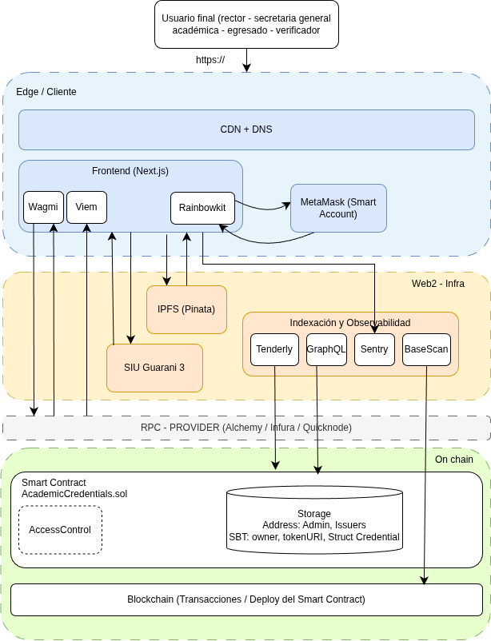
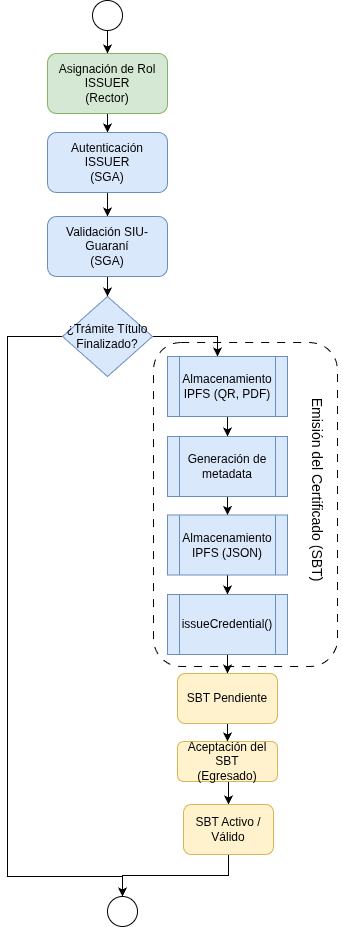
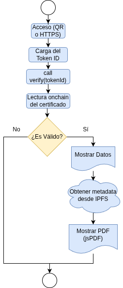

# Trabajo Final

  

  <em>Imagen: Blockchain (Wikimedia Commons - Creative Commons)</em>

---

# Desarrollo de Contratos Inteligentes y dApps

## Profesores

- **Dr. David Petrocelli**
- **Esp. Ciro Edgardo Romero**

## Alumno

- **Farías Roberto Adrián**

---

## Descripción

Trabajo Final correspondiente a la materia **Desarrollo de Contratos Inteligentes y dApps**.

El presente trabajo aborda el diseño e implementación de una solución basada en tecnología blockchain para la emisión, gestión y verificación de credenciales académicas digitales mediante Smart Contracts y Soulbound Tokens (SBTs).

---

## Año

2026

## **Caso de estudio**

En mayo de 2023, la Policía Federal desbarata la “Operación Alejo”: una red que había vendido más de 500 títulos secundarios y universitarios truchos, principalmente para ejercer en medicina y educación (Infobae, 2023). Dos años antes, en Río Cuarto, un chico de 19 años se hizo pasar por médico durante la pandemia usando una matrícula ajena, coordinó hisopados y reemplazó a profesionales en dispensarios (La Nación, 2021). En 2025, la Cámara Federal sigue procesando casos similares.

El problema no es que falten sistemas — es que los que hay no permiten verificar al instante quién emitió el título, ni con qué autoridad. Hoy en Argentina:

* SIDCER (Ministerio de Educación) digitalizó los diplomas, pero es centralizado: si el sistema cae o un dato se altera internamente, no hay verificación independiente.  
* Apostillar un título argentino para usarlo afuera cuesta USD 30-40 y 20-30 días corridos (Cancillería, TAD).  
* En Argentina hay un precedente: la Universidad Nacional de Córdoba implementó un Sistema de Validación Académica con smart contracts sobre blockchain, integrado a SIU Guaraní. Redujo el trámite de 4 meses a 2 semanas y ganó el Premio Internacional MetaRed TIC 2025 (categoría Tecnología para la Gestión Universitaria). El resto del sistema universitario nacional (UBA, UNLP, UTN, ITBA, UNQ) todavía no tiene nada institucional — UNC es el caso a estudiar y a emular.

## **Propuesta**

Se propone el desarrollo de una solución empleando tecnologías como blockchain y firma digital para transformar el certificado del título en una credencial segura, inmutable y verificable públicamente. Esta credencial digital permitirá que cada persona tenga control total sobre sus certificaciones, pudiendo acceder a ellas cuando y donde lo necesite, para almacenarlos, compartirlos y validarlos en cualquier momento de manera independiente y segura.

La W3C, define una *credencial como* un conjunto de una o más declaraciones realizadas por una misma entidad. Las credenciales pueden incluir un identificador y metadatos que describen sus propiedades, como la referencia al emisor, la fecha de validez, una imagen representativa, el mecanismo de revocación, etc. Por otro lado, una *credencial verificable* es un conjunto de declaraciones y metadatos que también incluye mecanismos de verificación que prueban criptográficamente quién la emitió, garantizan que los datos no hayan sido manipulados.

El uso de blockchain para el desarrollo de una Dapp para la emisión de títulos aporta los siguientes beneficios: 

* Inmutabilidad. Los certificados son inmutables y no se pueden modificar. La cadena de bloques es un registro inmutable y distribuido de transacciones, donde cada bloque se basa en el anterior. Cuando se emite un certificado, sus datos se comprimen en un hash y se registran en la cadena de bloques.  
* Tansparencia/confianza. Al combinarla con firmas digitales, la tecnología blockchain establece una estructura segura y transparente para almacenar y verificar datos, tanto del propio certificado, como la identidad del emisor y del propietario del mismo.  
* Verificación, el servicio de verificación garantiza que el estado del certificado no haya expirado, y que el certificado no ha sido revocado, ni adulterado. La forma más segura de garantizar su validez es utilizar un servicio de verificación independiente que compruebe la cadena de bloques. Este procedimiento no puede ser falsificado.  
* Descentralización. Se garantiza la identidad de los participantes en un modo descentralizado y autosoberano. El proceso de validación puede ser realizado por todos  los participantes de la red por lo cual se elimina la condición limitante de un único punto de fallo.  
* Identidad autosoberana. A diferencia del sistema actual, las certificaciones basadas en la solución propuesta, otorgarán al usuario la propiedad total de sus credenciales. Al ser archivos autoportantes y estandarizados, las personas podrán almacenar, compartir y validar sus logros de forma independiente, sin depender de la disponibilidad de los sistemas de la Universidad ni de trámites administrativos de verificación. 

**¿Qué área de UNQ operaría el sistema?** (rectorado, secretaría académica, decanato de facultad)

La Dapps a desarrollar debería ser gestionada por la máxima autoridad institucional (Rectorado). En este caso, rectorado administraría permisos y configuraciones críticas. El rectorado, otorgaría a la wallet de la Secretaría General Académica, permisos para emitir y revocar títulos.

Dado que la Secretaría General Académica tiene entre sus funciones:

* organizar y supervisar el trámite de Títulos/Diplomas que serán emitidos por la universidad, resguardando su autenticidad, así como la inviolabilidad del Libro de Registro de Títulos;  
* supervisar el trámite de Legalización de Títulos/Diplomas emitidos por la Universidad ante los organismos de Educación Superior competentes;  
* realizar la verificación y el control de la documentación y registros institucionales que avalen el efectivo cumplimiento por parte de los estudiantes de los requisitos de actuación académica, reglamentarios y formales, exigibles para acceder en cada caso a los Títulos y Diplomas de pregrado, grado y postgrado que otorga la Universidad;  
* controlar la autenticidad de Títulos y Diplomas, y tramitar su inscripción y registro en los organismos oficiales que corresponda;  
* emitir certificados de Títulos/Diplomas de postgrado en trámite;  
* y emitir las certificaciones de Títulos y Diplomas de pregado y grado expedidos por la Universidad,

se considera, que es el área idónea para la emisión de los certificados verificables en la cadena de bloques.

**¿Cómo encaja en el flujo actual?**(¿reemplaza SIDCER? ¿corre en paralelo? ¿es una capa de verificación pública sobre lo que ya hay?)

Con respecto al circuito de expedición de Títulos de pregrado, grado, y postgrado, la emisión del certificado digital, o credencial verificable, en la cadena de bloques (blockchain), tiene dos aspectos:

* Flujo complementario. El flujo asociado a la aplicación propuesta inicia luego de finalizado el trámite en sidcer y luego de que el diploma en papel moneda es impreso y rubricado con las firmas de las autoridades de la Universidad. Acontecido este hito del circuito administrativo, la versión digital, en formato pdf, se envía para su firma criptográfica por parte de las autoridades y se da inicio al proceso de registro de la certificación y metadatos en la cadena de bloques.   
* Flujo paralelo. Se prevé, en forma paralela, un circuito destinado al registro de las certificaciones emitidas con anterioridad a la implementación de la DApp. Si bien las certificaciones digitales resultantes estarán firmadas criptográficamente por las autoridades vigentes al momento de su emisión digital, y no por aquellas que ejercían sus funciones cuando se otorgó originalmente el título o certificado, la validez y autenticidad de la documentación se mantienen plenamente. Asimismo, la incorporación de tecnologías criptográficas y de registro distribuido fortalece los mecanismos de verificación, trazabilidad e integridad de las certificaciones emitidas.

**¿Quién es el usuario que se beneficia?** (egresado que aplica afuera, empleador que verifica, la propia universidad)

Esta solución, plantea múltiples beneficiarios:

* Los Egresados. 

  * La titularidad o posesión del certificado es verificable.

  * El certificado generado es portable, por lo cual permite la movilidad del egresado. 

  * La verificación de la validez no depende de existencia de la Universidad Emisora. El certificado existe en la cadena y se puede validar accediendo desde cualquier nodo de la red.

  * El egresado controla sus credenciales y decide con quién compartir sus datos para su validación no dependiendo para ello de una única institución validadora. (soberanía digital)

  * La validación de la autenticidad del certificado es inmediata y no está sujeta a los tiempos burocráticos de circuitos administrativos.

* Universidad. 

  * Se delega la validación de títulos a la blockchain. Se elimina el único punto de fallo.

  * Se simplifica el circuito para validar los títulos de egresados en otras universidades, siempre y cuando hayan sido emitidos en la blockchain.

  * Es una iniciativa que propicia la despapelización y apunta a la digitalización de las organizaciones.

  * Esta implementación minimiza el riesgo de emisión de títulos ilegítimos, actos delictivos que dañan la imagen y prestigio de la universidad. Los certificados son inmutable y verificables (se puede probar la identidad del emisor y la propiedad o identidad del egresado)

* Empleador.

  * Puede verificar de manera inmediata la autenticidad y validez de un certificado, accediendo a la aplicación provista por la Universidad, o incluso, basado en el principio de no confianza, consultar directamente sobre un nodo de la red (o su propio nodo si dispone de uno).

**¿Por qué blockchain y no una base de datos firmada?** (defender la elección — si una BD centralizada alcanza, decirlo)

Una solución basada en una base de datos centralizada, aun cuando los certificados se encuentren firmados digitalmente, genera una dependencia respecto de la institución emisora para su validación. La verificación de la autenticidad de un certificado depende de la existencia de la universidad y de la disponibilidad permanente de los servicios y sistemas informáticos encargados de dicha validación.

Asimismo, este esquema presenta un único punto de falla. Un incidente de seguridad, una configuración incorrecta o la compromisión de los sistemas de validación podría afectar la integridad de la información almacenada y la confianza en las certificaciones emitidas. Además, terceros maliciosos podrían intentar crear sitios o mecanismos de validación fraudulentos con el objetivo de engañar a los verificadores.

La necesidad de consultar a la institución emisora para corroborar la autenticidad de una credencial también puede generar desconfianza en algunos empleadores u organismos receptores, especialmente en contextos internacionales. En consecuencia, podrían requerirse mecanismos adicionales de validación, como certificaciones notariales, legalizaciones institucionales o apostillados, lo que incrementa los tiempos y costos asociados a la acreditación de credenciales académicas y afecta la movilidad de los egresados.

Por otra parte, el servidor central que almacena los documentos firmados se encuentra expuesto a diversas amenazas, tales como ataques de denegación de servicio, accesos no autorizados o alteraciones de la información. Entre los riesgos más relevantes se encuentran la modificación fraudulenta de registros existentes o la incorporación de registros apócrifos, comprometiendo la confianza en el sistema.

## **Arquitectura**

Imagen 1\. Diagrama de Arquitectura

En la Imagen 1 se observa la arquitectura propuesta. La misma se basa en los siguientes diagramas vistos en clase[^1]:

* Las tres capas de un sistema blockchain

* Arquitectura real del sistema de credenciales

### **Componentes**

Se caracteriza por los siguientes componentes que se describen a continuación:

Edge / Cliente. Es la capa más cercana al usuario. Se compone de:

* Una capa de ingreso a la aplicación que cumple dos funciones: DNS – resuelve el dominio de la aplicación, y CDN – distribuye y cachea contenido desde servidores cercanos.  
* Frontend: Desarrollado en nextjs. Emplea librerías como wagmi para la interacción con contratos inteligentes a través de la Interfaz Binaria de Aplicación (ABI) mediante llamadas RPC a la blockchain, viem para la lectura de datos on-chain y procesamiento de eventos emitidos por los smart contracts, y RainbowKit para la integración y gestión de wallets facilitando la conexión de usuarios con la aplicación descentralizada (dApp).  
* Wallet del usuario: Billetera a través de la cual los usuarios, con el rol Admin Default y/o Issuer\_Role, se autentican y firman las transacciones. En la sección Autenticación y Firma se detalla el tipo de wallet que se pretende utilizar en esta implementación.

Web2 Infra – 3ks. APP web tradicional. Base de datos, almacenamiento y observabilidad. Se compone de:

* Aplicación Guaraní 3: Es el sistema de gestión Académica utilizado por la Universidad a través del cual se tramita la expedición de Títulos académicos. En este trabajo se considera al sistema Guarani 3 como la fuente autentica de datos académico razón por la cual se confía en los datos que allí residen. El frontend interactuará mediante API/REST con Guarani 3 para verificar la finalización del trámite de título y consultar los datos del Egresado (datos filiatorios y título alcanzado). Esta integración tiene como objetivo automatizar la obtención de la información académica requerida, reduciendo la intervención manual en la carga de datos y minimizando la posibilidad de errores de transcripción o inconsistencias en la información registrada.  
* Sistema de Archivos Interplanetario (IPFS). Se utilizará este servicio de almacenamiento para alojar los metadatos asociados a la titulación y el certificado del título en formato pdf firmado digitalmente por las autoridades. En la sección Almacenamiento se fundamenta su elección.  
* Indexación y observabilidad: Se empleará BaseScan para exploración y verificación de actividad on-chain; GraphQL para consulta eficiente de eventos indexados; Tenderly para monitoreo, simulación y depuración de smart contracts; y Sentry para observabilidad y seguimiento de errores en los componentes de la aplicación.

RPC-Provider: Brinda una capa de acceso a la cadena de bloques a través de Llamadas a Procedimientos Remotos. Permite consultar el estado on-chain, ejecutar llamadas a contratos inteligentes, y enviar transacciones y suscripción a eventos. Es a través de este componente que la Aplicación puede comunicarse con la Dapp desarrollada.

Onchain: Componente inmutable, público y descentralizado. Se compone de:

* Cadena de bloques. Donde se persistirán de manera segura e inmutable los bloques con las transacciones, y el smart contract deployado.  
* Contrato inteligente (smart contract). Es la aplicación distribuida (Dapp) que contiene la lógica del negocio para:

  * Habilitar y/o denegar la ejecución de funciones según el rol del usuario.

  * Otorgar permisos de emisión y revocación de títulos.

  * Emitir un certificado digital o SBT.

  * Revocar un certificado digital o SBT.

  * Consultar y/o validar un SBT.

  * Aceptar o rechazar un SBT. (ver la sección Token Soulbound Rechazable)

* Storage. Se almacenan las address de lo usuarios con rol admin, y/o con rol Issuer, y  para cada SBT se almacena el address del egresado (owner), el token URI (CID de los metadatos almacenados en IPFS), y datos relevantes en una estructura de datos Struct.

En las siguientes secciones detallan alguno de los componentes y tecnologías mencionadas.

### **Red blockchain**

En primera instancia, se propone utilizar la red Ethereum por presentar las siguientes características:

* Descentralizada: Su carácter descentralizado, distribuido, y por la cantidad de nodos que la integran, lo cual a su vez fortalece la confianza y la transparencia.

  Tal como se menciona en (Fartitchou et al., 2024), la estructura descentralizada de Ethereum garantiza que ninguna entidad tenga control sobre toda la red, lo cual es fundamental para mantener la confianza y la transparencia en un sistema de certificación digital .

* Inmutabilidad y seguridad: Los datos registrados en la blockchain de Ethereum no se pueden modificar ni eliminar, lo que la convierte en una plataforma ideal para almacenar certificados digitales. Esta inmutabilidad garantiza la integridad y autenticidad de los certificados, asegurando que sean verificables y resistentes a la falsificación o a las alteraciones no autorizadas (Fartitchou et al., 2024\).  
* Maquina de turing completa: Ethereum admite contratos inteligentes, que nos permiten automatizar procesos como la emisión, validación y revocación de certificados (Fartitchou et al., 2024\).  
* De uso público: Cualquier persona puede utilizarla y tener una copia de la cadena en un nodo propio. Esto fortalece el principio de No confiar y validar por sí mismo los datos de la cadena. Además existen diversas herramientas que permiten analizar y explorar la cadena.  
* Basado en estándares: Cuenta con estándares relevantes que se ajustan perfectamente a la implementación que se pretende lograr en el presente trabajo (por ej. el ERC721 para NFT)  
* Comunidad y soporte: La activa comunidad de desarrolladores también nos brinda acceso a soporte continuo, actualizaciones y mejoras de la plataforma.

Dado que la utilización de Ethereum puede implicar costos operativos variables asociados al pago de gas, se propone como alternativa el uso de la BFA (Blockchain Federal Argentina).

La BFA opera bajo un modelo de consenso federado, en el cual múltiples organizaciones participan en la validación de transacciones y en el mantenimiento de la cadena de bloques. En este escenario, la Universidad podría integrarse junto con otras universidades e instituciones públicas o privadas para validar certificaciones académicas y contribuir al funcionamiento de la red.

Como principal limitación, la BFA funciona bajo un esquema permissioned; es decir, la incorporación de nuevos nodos validadores requiere la autorización de las entidades responsables de la gobernanza de la red. Si bien este enfoque permite establecer mecanismos de control, confianza y coordinación entre los participantes, introduce cierto grado de centralización en comparación con las redes públicas y abiertas, donde cualquier actor puede participar libremente en el proceso de validación.

### **Token Soulbound Rechazable**

Para la implementación de las credenciales digitales se propone el uso de un NFT (Non-Fungible Token), debido a su capacidad para representar de manera única activos del mundo real en una red blockchain.

En el caso de las credenciales académicas, (Pericàs-Gornals et al., 2024\) identifican como requisitos fundamentales la intransferibilidad de la credencial y la aceptación explícita por parte del usuario que la recibirá.

Una vez emitida, la credencial debe permanecer asociada a su titular y no debe poder transferirse a terceros no autorizados. Asimismo, el modelo propuesto por los autores contempla que el destinatario pueda decidir si acepta o rechaza la recepción de la credencial digital.

Un NFT que no puede transferirse a otra dirección se conoce como Soulbound Token (SBT). Cuando, además, requiere la aceptación explícita del destinatario antes de quedar asociado a su billetera digital, se denomina Rejectable Soulbound Token (RejSBT).

Los SBT constituyen una alternativa adecuada para la representación de títulos, certificados y otras credenciales académicas digitales, dado que permiten vincular una credencial de forma permanente a su titular e impedir su transferencia a terceros.

Por su parte, los RejSBT (Pericàs-Gornals et al., 2024\) incorporan un mecanismo de aceptación que evita que una entidad maliciosa o no autorizada pueda asociar credenciales no deseadas al perfil digital de un usuario. Este enfoque proporciona las siguientes garantías:

* No repudio: la entidad emisora de la credencial digital no puede negar la emisión del token, mientras que el destinatario no puede negar la acción realizada sobre la credencial, ya sea su aceptación o su rechazo.  
* Recepción selectiva: el estudiante puede decidir si acepta o rechaza la recepción de la credencial digital antes de que esta quede asociada de manera permanente a su billetera.

En la propuesta desarrollada en este trabajo se adopta el modelo RejSBT, ya que combina la intransferibilidad propia de los SBT con un mecanismo de aceptación explícita por parte del destinatario.

### **Almacenamiento**

Se propone un almacenamiento en dos capas:

* Offchain: Se propone utilizar el Sistema de Archivos Interplanetario (IPFS) que es una solución de almacenamiento descentralizada diseñada para almacenar y compartir datos a través de una red distribuida. A diferencia de los servidores centralizados tradicionales, IPFS utiliza un modelo peer-to-peer, donde los datos se dividen en fragmentos más pequeños, se almacenan en múltiples nodos y se enlazan mediante hashes criptográficos únicos llamados Identificadores de Contenido (CID) (Farabi et al., 2025). Tal como se menciona en (Fartitchou et al., 2024), IPFS nos permite almacenar grandes conjuntos de datos fuera de la cadena, manteniendo solo la información crítica en la cadena de bloques. Este enfoque reduce la carga de almacenamiento y mejora el rendimiento y la escalabilidad del sistema.

  En nuestra arquitectura, durante la emisión del certificado del título, el frontend, llamará a una función de almacenamiento para subir el archivo JSON con metadatos a la red IPFS y añadir un identificador de contenido (CID) a la red Ethereum. Más precisamente, almacenará el CID en un contrato Ethereum que asociará el token RejSBT con el CID del archivo IPFS.

	Los metadatos que se almacenaran en el IPFS tendrán los siguientes datos o atributos:

* El diploma en formato pdf (firmado digitalmente por las autoridades competentes)

  * Datos sobre el diploma en una estructura json:

    * nombre de la carrera

    * nombre de la universidad

    * fecha de emisión

    * Imagen QR con enlace de validación

    * CID del diploma en formato pdf

  En caso de que, en el futuro, ningún nodo de la red IPFS mantenga disponible el archivo JSON correspondiente a los metadatos de una credencial, se propone como mecanismo de contingencia la incorporación de una función que permita actualizar el valor de tokenURI asociado al SBT. Mediante este mecanismo, la Universidad podría volver a publicar el archivo JSON original en un nodo IPFS, obteniendo un nuevo CID y actualizando posteriormente el tokenURI almacenado en el contrato inteligente. De esta manera, se restablecería el acceso a los metadatos sin necesidad de emitir una nueva credencial. Para preservar la integridad de la certificación, el contenido del archivo JSON republicado deberá ser idéntico al original, modificándose únicamente su ubicación dentro de la red IPFS.

* OnChain. En el contrato se almacenarán los RejSBT emitidos y por cada uno de ellos:

  * el CID correspondiente al json almacenado en el IPFS (el URI del token)

  * el apellido, nombre y dni del egresado hasheado

  * el hash del diploma firmado digitalmente

  * la validez del token

  * address del emisor

  * fecha de emisión

  También se almacenará, mediante mapping, los IDTokens emitidos a una address de un egresado.

### **Struct del certificado**

Se propone la siguiente estructura de datos para ampliar la información asociada a cada certificado digital o RejSBT emitido:

struct Credential {

    string degreeName;       // "Licenciatura en Sistemas de Información"

    bytes32 studentNameHash; // keccak256(nombre completo \+ DNI) — privacidad

    uint256 issueDate;       // timestamp de emisión

    bytes32 documentHash;    // keccak256 del PDF original del título

    bool active;             // false si fue revocado

}

mapping(uint256 \=\> Credential) public credentials;

Los atributos del struct son:

* degreeName: Nombre de la carrera del egresado  
* studentNameHash: Es un hash del nombre completo del egresado concatenado con su DNI. Dado que los datos almacenados en el storage de los contratos son públicos, se propone hashear los datos filiatorios del egresado a efectos de garantizar su privacidad. Luego si un empleador o persona desea validar la identidad del egresado asociado a la credencial, deberá conocer su nombre, apellido y dni.  
* IssueDate: Fecha de emisión  
* documentHash: El atributo documentHash corresponde al valor hash criptográfico del archivo PDF que contiene el título firmado digitalmente por las autoridades de la Universidad. Este valor constituye un elemento crítico para la validación de la integridad y autenticidad del documento emitido. El documentHash se almacena de forma independiente del metadataURI, debido a que representa la evidencia criptográfica utilizada para verificar que el documento presentado coincide exactamente con el documento originalmente emitido. Si este dato se almacenara únicamente como un atributo dentro de los metadatos referenciados por el metadataURI, su disponibilidad dependería de la persistencia y accesibilidad del sistema de almacenamiento utilizado.

  Por este motivo, el documentHash se registra directamente en la blockchain, garantizando su disponibilidad, inmutabilidad y resistencia a modificaciones no autorizadas. De esta manera, cualquier verificador podrá recalcular el hash del documento PDF presentado y compararlo con el valor almacenado en la cadena de bloques para comprobar que el contenido no ha sido alterado desde su emisión.

* Active: Verdadero si el SBT es válido y falso si fue revocado. Tal como lo propone (Farabi et al., 2025), se utiliza una variable para establecer el estado del SBT. Cabe destacar que durante el proceso de revocación, el NFT es quemado pero se conserva su struct asociado con el estado activo en false.

### **Gobernanza y Control de Acceso Basado en Roles**

Se propone implementar una lógica para el control de accesos usando la plantilla AccessControl que provee OpenZeppellin.

Un esquema similar, pero con una implementación diferente se observa en el trabajo de (Fartitchou et al., 2024). En este trabajo, se crean contratos para otorgar permisos de manera jerárquica. A través del deploy de determinados contratos se habilitan a las universidades afiliadas a emitir certificados y a autorizar determinados perfiles.

En (Farabi et al., 2025), también se propone un control de acceso basado en roles, de los cuales destacamos los siguientes:

* Reguladores: Actúan como intermediarios, manteniendo un registro actualizado de las instituciones autorizadas, haciendo cumplir las políticas de emisión y auditando las actividades institucionales.  
* Instituciones: Las universidades y facultades autorizadas por los reguladores pueden emitir nuevos certificados o revocar los fraudulentos o inválidos. Interactúan directamente con los contratos inteligentes.

En nuestra arquitectura, el control de acceso se realiza mediante un contrato que hereda de AccessControl de OpenZeppelin. Contaremos con dos roles:

* Administrador (Admin) que será el encargado de habilitar al o los emisores de credenciales dentro de la universidad. Este rol corresponderá al Rector.   
* Emisor de títulos (ISSUER\_ROLE). En principio, este rol será ejercido por el área de la Secretaría General Académica. A través de este rol, podrá emitir y revocar títulos (se corresponde con el rol de Instituciones en la propuesta de Farabi).

### **Autenticación y Firma**

Se plantea el uso de wallets para la autenticación y para la firma de las transacciones.

Dado que se prevé que cada egresado disponga de una billetera digital para recibir y gestionar sus certificados académicos o SBTs, la pérdida de las credenciales de acceso constituye un riesgo que debe ser considerado en el diseño de la solución. En los esquemas tradicionales de billeteras autocustodiadas, la pérdida de la clave privada o de la frase semilla puede ocasionar la pérdida permanente del acceso a los activos almacenados.

Con el fin de mitigar este riesgo, se propone la utilización de smart contract wallets (Ohlhaver et al., 2022), las cuales incorporan mecanismos avanzados de gestión y recuperación de acceso implementados mediante contratos inteligentes. Este enfoque permite definir procedimientos de recuperación basados en guardianes, múltiples autorizaciones u otras políticas configurables, reduciendo la dependencia de una única credencial de acceso.

De esta manera, los egresados dispondrían de un mecanismo para recuperar el control de sus credenciales académicas digitales en caso de pérdida o compromiso de las claves utilizadas para acceder a la billetera, mejorando la usabilidad y reduciendo el riesgo de pérdida permanente de los activos digitales.

## **Diagrama de flujo de emisión**

Imagen 2\. Diagrama de Flujo de Emisión de Credenciales Verificables

El rector asigna el rol ISSUER\_ROLE a la Secretaria/o General Académica/o para que pueda emitir y revocar certificados de títulos.

La Secretaria General Académica ingresa al frontend del sistema propuesto, y se autentica con su wallet.

En la aplicación, elige la opción Emitir Certificado. En el formulario ingresa el DNI del Egresado.

El frontend a través de API REST consulta, al sistema de Gestión Académica SIU-Guaraní 3, si el  trámite de título ha finalizado. De ser así, la API retorna los datos filiatorios del egresado y el nombre de la carrera de la cual egresa. Estos datos se cargan de manera automática en el formulario de emisión del certificado o SBT. Si el trámite no ha finalizado aún, el proceso se detiene.

Si el trámite se encuentra finalizado, y los datos del egresado se muestran cargados en el formulario, el ISSUER adjunta el título en formato PDF firmado digitalmente por las autoridades de la Universidad y carga el address de la wallet del egresado.

El ISSUER procede a la emisión del SBT.

El frontend ejecuta los siguientes pasos:

* Sube el pdf al servicio de IPFS elegido (ej. Pinata). El servicio retorna el CID del documento.  
* Se genera una url de validación con el tokenID ingresado en el formulario y a partir de la misma se genera una imagen QR.  
* Se sube la imagen QR al servicio de IPFS elegido (ej. Pinata). El servicio retorna el CID de la imagen.  
* En tiempo de ejecución se crean los metadatos, en formato json, con el cid del pdf, el cid del QR, el nombre de la carrera finalizada por el egresado, el nombre de la Universidad, y la fecha de emisión del título.  
* Se sube los metadatos, en formato json, al servicio de IPFS elegido (ej. Pinata). El servicio retorna el CID del archivo json.  
* Se calculan los hashes para los atributos studentNameHash y documentHash.  
* Se invoca mediante RPC a la función issueCredential con los parámetros correspondientes y el ISSUER firma la transacción con la clave privada de la wallet.

Dado que se propone implementar un SBT rechazable (Pericàs-Gornals et al., 2024), una vez emitido el SBT por la Secretaria General Académica, el egresado debe aceptar o rechazar el SBT.

El egresado ingresa a su wallet, visualiza un mensaje de confirmación con la opción de aceptar o rechazar el SBT.

El egresado acepta el SBT y este se almacena de manera permanente en su wallet sin posibilidad de ser transferido

## **Diagrama de flujo de verificación pública**

El empleador o verificador, ingresar a la url de verificación, del frontend, a través del escaneo de un QR, o a través del protocolo https. De hacerlo mediante QR, el Token ID del SBT se pasa como parámetro en la URL. En caso de ingresar por https, deberá ingresar el Token ID.

Una vez ingresado el Token ID, se invoca a la función verify del contrato a través de una llamada a la capa RPC. El método verify, lee del storage el struct asociado al token y retorna dos variabales:

* isValidCredential: true si es válido o false si fue revocado  
* record: el struct con los datos del certificado

El frontend, el cual se encuentra esperando la respuesta, recibe estos datos y los muestra por la interfaz.

Opcionalmente, el método verify podría devolver el CID de los metadatos del SBT y desde el frontend mostrar el certificado en PDF firmado digitalmente(Farabi et al, 2025).

Imagen 3\. Diagrama de Flujo de Verificación Pública

**Bibliografía**

Pericàs-Gornals, R., Mut-Puigserver, M., Payeras-Capellá, M. M., Cabot-Nadal, M. Á. y Ramis-Bibiloni, J. (2024). Digital credentials management system using rejectable soulbound tokens. *Annals of Telecommunications*, *79*, 843–855. [https://doi.org/10.1007/s12243-024-01032-6](https://doi.org/10.1007/s12243-024-01032-6)

Fartitchou, M., Lamaakal, I., El Makkaoui, K., El Allali, Z. y Maleh, Y. (2024). BlockMEDC: Blockchain Smart Contracts for Securing Moroccan Higher Education Digital Certificates. *IEEE Access*. [https://doi.org/10.1109/ACCESS.2024.DOI](https://doi.org/10.1109/ACCESS.2024.DOI)

Farabi, A., Khandaker, I., Ahsan, J., Shanto, I. K., Jahan, N. y Khan, M. J. (2025). *ShikkhaChain: A Blockchain-Powered Academic Credential Verification System for Bangladesh*. arXiv. [https://doi.org/10.48550/arXiv.2508.05334](https://doi.org/10.48550/arXiv.2508.05334)

Ohlhaver, P., Weyl, E. G. y Buterin, V. (2022). *Decentralized Society: Finding Web3’s Soul*. SSRN. https://ssrn.com/abstract=4105763

[^1]: 	https://dpetrocelli.github.io/diplounq2026/diagramas-arquitectura.html